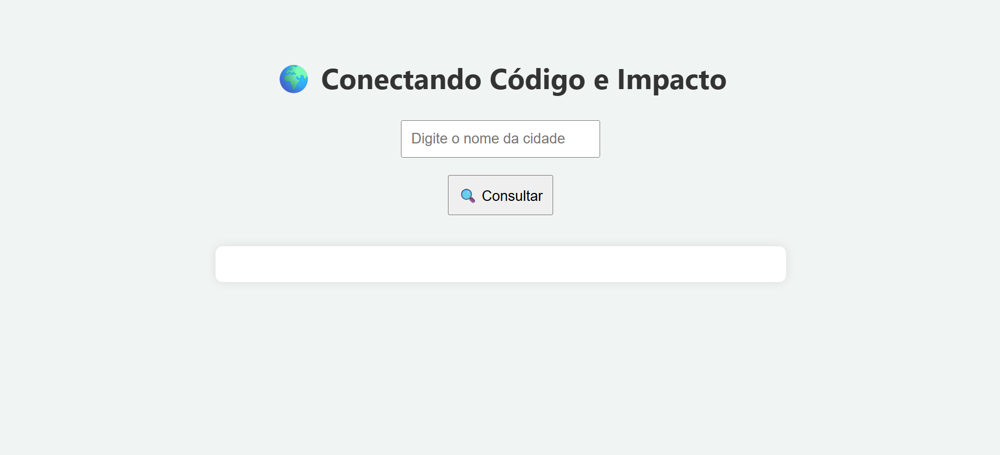

# 🌍 Qualidade do Ar - Conectando Código e Impacto

Uma aplicação web simples que consulta a qualidade do ar em tempo real de qualquer cidade utilizando a API da [API-Ninjas](https://api-ninjas.com/docs/airquality),  com interface limpa e responsiva.

## 🚀 Funcionalidades

- Consulta a qualidade do ar por nome da cidade
- Mostra os níveis de poluição:
  - Partículas finas (PM2.5)
  - Dióxido de Nitrogênio (NO₂)
  - Ozônio ao nível do solo (O₃)
- Classificação visual: Ótimo ✅ | Regular ⚠️ | Ruim ❌
- Interface amigável e responsiva

## 🔧 Tecnologias Utilizadas

- HTML5
- CSS3
- JavaScript
- API externa

## 🎯 Importante

Para rodar localmente, substitua `COLOQUE_SUA_API_AQUI` no arquivo `script.js` pela sua chave da [API-Ninjas](https://api-ninjas.com/). 

## 📷 Demonstração

## 🔗 Link para o Projeto

👉 [Ver Projeto ao Vivo](https://maike-simoncini.github.io/Qualidade_do_Ar/) 👈

## 📄 Licença

Este projeto é de código aberto e pode ser utilizado por qualquer pessoa.

